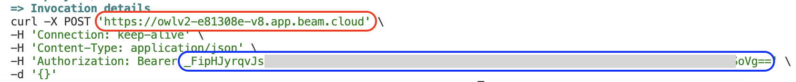
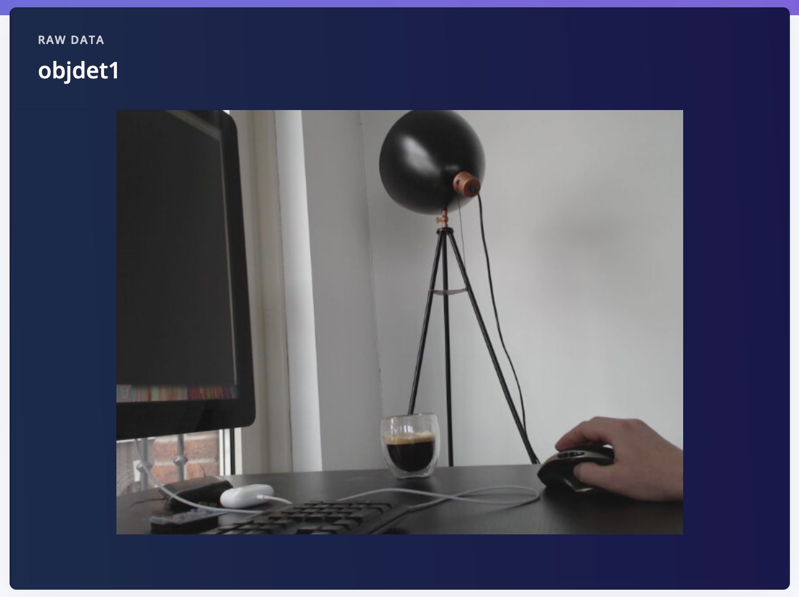
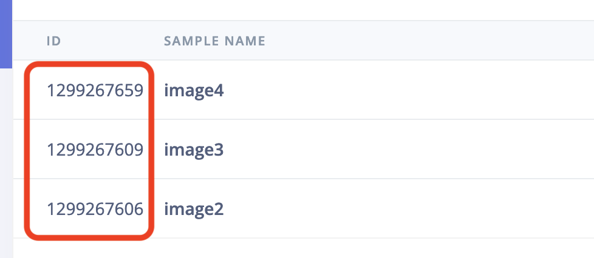

# AI labeling block: Zero-shot object detection labeling block (from HuggingFace)

This is an Edge Impulse [AI labeling block](https://docs.edgeimpulse.com/docs/edge-impulse-studio/organizations/custom-blocks/custom-ai-labeling-blocks) that uses a zero-shot object detector ([OWL-ViT](https://huggingface.co/docs/transformers/en/model_doc/owlvit)) from HuggingFace to add bounding boxes to your image data. You can use this repo as the basis for custom tasks that use big ML models to help with labeling or data quality tasks in your project.

## Use this from Edge Impulse (professional / enterprise)

If you just want to use this block as a labeling tool in your Edge Impulse project you don't need this repo. Just go to any project, select **Data acquisition > AI Labeling**, choose **Bounding box using OWL-ViT** (available for professional and enterprise projects only).

## Combining this block w/ GPT4o

It's hard to get complex objects or scenes to be labeled properly using zero-shot object detectors. To mitigate this you can combine zero-shot object detectors with an LLM, to verify that bounding boxes are correct, or to relabel them. See [ai-labeling-bounding-box-relabeling-gpt4o](https://github.com/edgeimpulse/ai-labeling-bounding-box-relabeling-gpt4o) on how to combine this block with GPT4o.

## Developing your own block

Spinning up GPUs in Edge Impulse (required to run OWL-ViT) might take 5-15 minutes, which is not great for the user experience when labeling data. As OWL-ViT is not available through HuggingFace's Inference APIs we've deployed OWL-ViT using [Beam.cloud](https://www.beam.cloud) - a serverless infrastructure for GPUs, which can spin up much quicker. If the HuggingFace model you want to use _is_ available through HuggingFace's Serverless Inference API that's even easier. See [ai-labeling-audio-spectrogram-transformer](https://github.com/edgeimpulse/ai-labeling-audio-spectrogram-transformer) for an example.

### 1. Deploying the inference server

1. Sign up for an account at [Beam.cloud](https://www.beam.cloud).
2. The Beam inference server (it's very simple) is implemented in [beam_inference_server.py](beam_inference_server.py). If you want to use a different HuggingFace model you can swap it out there.

    > You might want to lower `keep_warm_seconds` to keep cost under control. Currently the server will stay alive for 10 minutes after the last request.

3. Install the Beam Python dependencies, and deploy:

    ```
    python3 -m venv .venv-beam
    source .venv-beam/bin/activate
    pip3 install -r requirements-beam.txt

    beam deploy beam_inference_server.py:predict_owlv2
    ```

4. From the output of the `beam deploy` command, parse the endpoint, and your access key:

    

    Here the endpoint is in red (`https://owlv2-e81308e-v8.app.beam.cloud`), and the access key in blue (`_FipHJyrqvJs...oVg==`). You'll need these later so save them somewhere them.

### 2. Running this block locally

1. Create a new Edge Impulse project, and add some unlabeled images.

    

    *Non-labeled image*

2. Create a file called `ids.json` and add the IDs of the samples you want to label. You can find the sample ID by clicking the 'expand' button on **Data acquisiton**.

    

    Add these IDs to the `ids.json` file as an array of numbers, e.g.:

    ```json
    [1299267659, 1299267609, 1299267606]
    ```

3. Load your Edge Impulse API key, the Beam endpoint and the Beam access key:

    ```
    export EI_PROJECT_API_KEY=ei_44...
    export BEAM_ENDPOINT=https://owlv2-e81308e-v8.app.beam.cloud
    export BEAM_ACCESS_KEY=_FipHJyrqvJs...oVg==
    ```

    > You can find your Edge Impulse API Key via **Dashboard > Keys**.

4. Install the Python dependencies:

    ```
    # if you're still in .venv-beam, first run `deactivate`

    python3 -m venv .venv
    source .venv/bin/activate
    pip3 install -r requirements.txt
    ```

5. Run `inference_remote.py` to label your data:

    ```
    python3 -u inference_remote.py \
        --prompt "Coffee cup (coffee, 0.1)" \
        --delete_existing_bounding_boxes yes \
        --data-ids-file ids.json
    ```

6. Afterwards you'll have labeled data in your project!

    

### Pushing block to Edge Impulse (enterprise only)

If you've modified this block, you can push it back to Edge Impulse so it's available to everyone in your organization.

1. Update `parameters.json` to update the name and description of your block.
2. Initialize and push the block:

    ```
    $ edge-impulse-blocks init
    $ edge-impulse-blocks push
    ```

    You'll be prompted to enter the Beam endpoint and access key again.

    > **Important:** The Beam endpoint changes between deploys. To later update the Beam endpoint, go to your Edge Impulse organization, then **Custom blocks > Transformation**, find the block, click the three dots, and override the endpoint under "Additional environment variables".

3. Afterwards, you can run your block through **Data acquisition > AI labeling** in any Edge Impulse project.

### Proposed changes

AI Actions blocks should be able to run in 'preview' mode (triggered when you click *Label preview data* in the Studio) - where changes are _staged_ but not directly applied. If this is the case `--propose-actions <job-id>` is passed into your block. When you see this flag you should not apply changes directly (e.g. via `raw_data_api.set_sample_bounding_boxes`) but rather use the `raw_data_api.set_sample_proposed_changes` API. Search for this API in [inference_remote.py](inference_remote.py) to see how this should be used.
